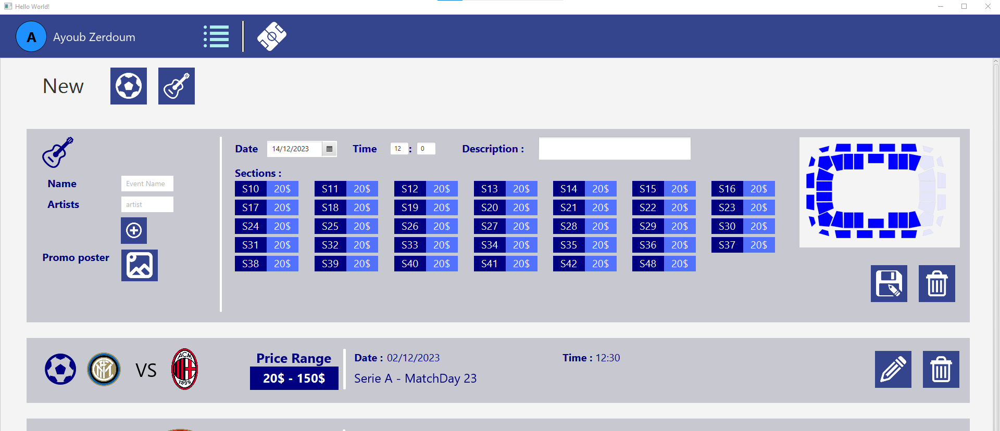

# Stadium Concert Ticket Sales Application

Developed as an academic project by:
- Ayoub ZERDOUM
- Mohamed Zied BOUOUD

## TECH used 
<ul>
  <li>Programming language :JAVA</li>
  <li>GUI :JAVAFX</li>
  <li>Database : mysql</li>
</ul>

## Project Overview
The application should allow users to :
<ul>
  <li>choose an event to attend</li>
  <li>view the stadium (top view)</li>
  <li>choose their seats</li>
  <li>purchase tickets for the seats</li>
  <li>purchase items from the stadium store</li>
</ul>
<strong>The goal is to provide a comprehensive and engaging user experience.</strong>
 
the application also provides an interface for the admin to : 
<ul>
  <li>configure the layout of its stadium</li>
  <li>add events ( match or concert) </li>
  <li>choose the available seats for each event</li>
  <li>choose the price of each section of the stadium</li>
</ul>

## Detailed Features

### USERS INTERFACES

<strong>Authentification</strong>

<strong>CHECK events , concerts and matchs</strong>

<strong>check the stadium layout and available seats</strong>

<strong>check the status of the seats : available / for resale / for switching / sold</strong>

<strong>After purchasing seats , the user can check his tickets</strong>

### ADMIN INTERFACES

<strong>Configure the layout of the stadium</strong>

<strong>Add matches and Concerts to the event list</strong>

<strong>Adding a Match + configure available sections and their price</strong>

<strong>Adding a Concert + configure available sections and their price</strong>

### DATABASE Config

 
 

### Incomplete Features
<ul>
  <li>ADMIN authentication interface not implemented yet. To switch between user mode and admin mode, you need to change the FXML file in the FXMLLoader (line 153)
               for the user --> /Vues/EventClient.fxml
               for the admin --> /Vues/EventManager.fxml
  </li>
  <li>The logic of switching, reselling of seats is still not implemented! To simulate them, you can add it directly to the database in the tables switch/resale, respectively.</li>
  <li>the shop interface isnt implemented yet !!!</li>
</ul>
